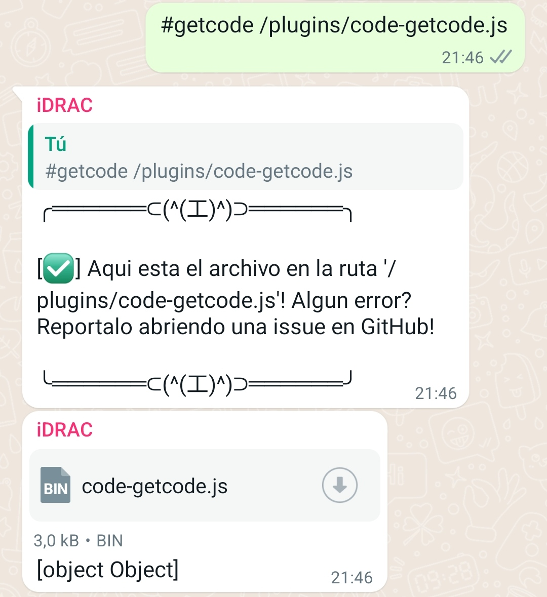
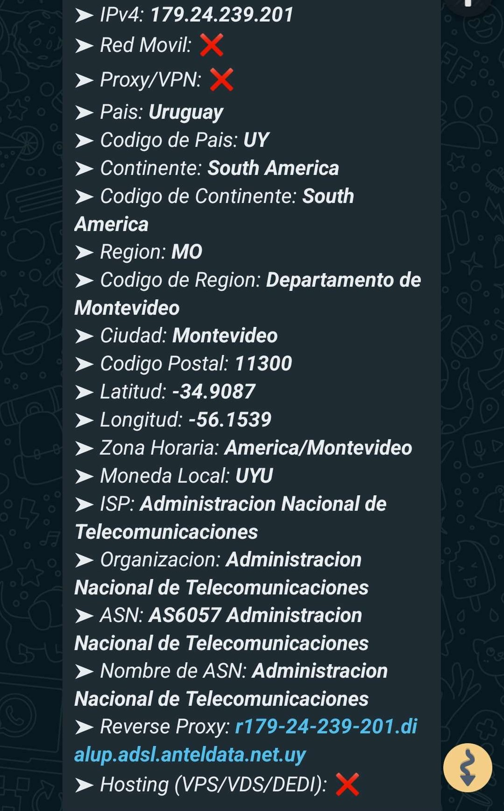

<div align="center">

  
  <h1>Mystic Plugins</h1>
  
  <p>
    Aumenta las capacidades de tu bot de WhatsApp con plugins adicionales! Plug and play!
  </p>
  
  
<!-- Badges -->

<p>
  <a href="https://github.com/TheH2SO4/Mystic-Plugins/graphs/contributors">
    
  </a>
  <a href="">
    
  </a>
  <a href="https://github.com/TheH2SO4/Mystic-Plugins/network/members">
    
  </a>
  <a href="https://github.com/TheH2SO4/Mystic-Plugins/stargazers">
    
  </a>
  <a href="https://github.com/TheH2SO4/Mystic-Plugins/issues/">
    
  </a>
  <a href="https://github.com/TheH2SO4/Mystic-Plugins/blob/master/LICENSE">
    
  </a>
</p>
   
<h4>
  <span> · </span>
    <a href="https://github.com/TheH2SO4/Mystic-Plugins/issues/">Reportar Bug</a>
  <span> · </span>
    <a href="https://github.com/TheH2SO4/Mystic-Plugins/issues/">Sugerir Plugin</a>
  </h4>
</div>

<br />

# :notebook_with_decorative_cover: Plugins disponibles

- [Tools](#notebook_with_decorative_cover-plugins-disponibles)
  * [GetFile](#camera-getfile-screenshots)
  * [TrackIP](#camera-trackip-screenshots)

## :star2: Acerca de GetFile


### :camera: GetFile Screenshots

<div align="center"> 
  
</div>

### :space_invader: GetFile Dependencias Usadas

<details>
  <summary>Dependencias</summary>
  <ul>
    <li><a href="https://www.npmjs.com/package/fs">fs</a></li>
  </ul>
</details>

### :gear: GetFile Instalacion

[✅] Plug and play!

Descarga el plugin, copialo y simplemente pegalo en la carpeta plugins.
Reinicia tu bot y listo!

<!-- Usage -->
## :eyes: GetFile Uso

```
    #getfile + < ruta >
```

(Ejemplo ->)

```
    #getfile /plugins/tools-getfile.js
```

## :compass: GetFile Roadmap

* [x] Comprobar rutas
* [ ] Permisos modificables (Owner, Admin)

## :star2: Acerca de TrackIP


### :camera: TrackIP Screenshots

<div align="center"> 
  
</div>

### :space_invader: TrackIP Dependencias Usadas

<details>
  <summary>Dependencias</summary>
  <ul>
    <li><a href="https://www.npmjs.com/package/@sarequl/client-ip-details">@Sarequl/Client-ip-details</a></li>
    <li><a href="https://www.npmjs.com/package/is-ip">Is-ip</a></li>
    <li><a href="https://www.npmjs.com/package/currency-symbol-map">Currency-symbol-map</a></li>
    <li><a href="https://www.npmjs.com/package/country-locale-map">Country-locale-map</a></li>
    <li><a href="https://www.npmjs.com/package/countryjs">Countryjs</a></li>
  </ul>
</details>

### :gear: TrackIP Instalacion

[❌] Plug and play.

Descarga el plugin, copialo y simplemente pegalo en la carpeta plugins.
  Corre el siguiente comando para instalar la dependencia:

```Bash
  npm install --save @sarequl/client-ip-details is-ip currency-symbol-map country-locale-map countryjs
```

Reinicia tu bot y listo!

<!-- Usage -->
## :eyes: TrackIP Uso

```
    #trackip + <IPv4/IPv6 publica>
```

(Ejemplo ->)

```
    #trackip 179.24.239.201
```

## :compass: TrackIP Roadmap

* [x] Verificacion IP real

<!-- Contributing -->

## :wave: Contribuyendo

<a href="https://github.com/TheH2SO4/Mystic-Plugins/graphs/contributors">
  
</a>


Futuras contribuciones seran siempre bienvenidas!


<!-- Code of Conduct -->
<!-- ### :scroll: Code of Conduct

Please read the [Code of Conduct](https://github.com/TheH2SO4/Mystic-Plugins/blob/master/CODE_OF_CONDUCT.md)

<!-- FAQ -->
<!-- ## :grey_question: FAQ

- Question 1

  + Answer 1

- Question 2

  + Answer 2


<!-- License -->

## :warning: Licencia

El software esta distribuido debajo de la licencia Apache 2.0. Hechale un ojo a LICENSE para mas informacion acerca de esta.


<!-- Contact -->

## :handshake: Contacto

Th3H2SO4 - [@Th3H2SO4](https://twitter.com/th3h2so4) - TheH2SO4@protonmail.com

Link del proyecto: [TheH2SO4/Mystic-Plugins](https://github.com/TheH2SO4/Mystic-Plugins)


<!-- Acknowledgments -->
<!-- ## :gem: Acknowledgements

Use this section to mention useful resources and libraries that you have used in your projects.

 - [Shields.io](https://shields.io/)
 - [Awesome README](https://github.com/matiassingers/awesome-readme)
 - [Emoji Cheat Sheet](https://github.com/ikatyang/emoji-cheat-sheet/blob/master/README.md#travel--places)
 - [Readme Template](https://github.com/othneildrew/Best-README-Template)
