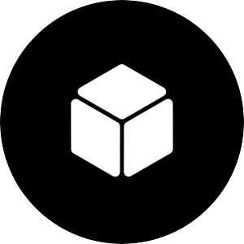

<div align="center">

  
  <h1>Mystic Plugins</h1>
  
  <p>
    Aumenta las capacidades de tu bot de WhatsApp con plugins adicionales! Plug and play!
  </p>
  
  
<!-- Badges -->
<p>
  <a href="https://github.com/TheH2SO4/Mystic-Plugins/graphs/contributors">
    
  </a>
  <a href="">
    
  </a>
  <a href="https://github.com/TheH2SO4/Mystic-Plugins/network/members">
    
  </a>
  <a href="https://github.com/TheH2SO4/Mystic-Plugins/stargazers">
    
  </a>
  <a href="https://github.com/TheH2SO4/Mystic-Plugins/issues/">
    
  </a>
  <a href="https://github.com/TheH2SO4/Mystic-Plugins/blob/master/LICENSE">
    
  </a>
</p>
   
<h4>
    <!-- <a href="https://github.com/TheH2SO4/Mystic-Plugins/">View Demo</a>
  <span> · </span>
    <a href="https://github.com/TheH2SO4/Mystic-Plugins">Documentation</a> -->
  <span> · </span>
    <a href="https://github.com/TheH2SO4/Mystic-Plugins/issues/">Reportar Bug</a>
  <span> · </span>
    <a href="https://github.com/TheH2SO4/Mystic-Plugins/issues/">Sugerir Plugin</a>
  </h4>
</div>

<br />

# :notebook_with_decorative_cover: Plugins disponibles

- [Coding](#notebook_with_decorative_cover-plugins-disponibles)
  * [GetCode](#camera-getcode-screenshots)
<!-- - [Usage](#eyes-usage)
- [Roadmap](#compass-roadmap)
- [Contributing](#wave-contributing)
  * [Code of Conduct](#scroll-code-of-conduct)
- [FAQ](#grey_question-faq)
- [License](#warning-license)
- [Contact](#handshake-contact)
- [Acknowledgements](#gem-acknowledgements) -->

## :star2: Acerca de GetCode


### :camera: GetCode Screenshots

<div align="center"> 
  
</div>

### :space_invader: GetCode Dependencias Usadas

<details>
  <summary>Dependencias</summary>
  <ul>
    <li><a href="https://www.javascript.com/">JavaScript</a></li>
    <li><a href="https://nodejs.org/">NodeJs</a></li>
    <li><a href="https://www.npmjs.com/package/@adiwajshing/baileys">@Adiwajshing/Baileys</a></li>
    <li><a href="https://www.npmjs.com/package/fs">fs</a></li>
  </ul>
</details>

<!--
### :key: Environment Variables

To run this project, you will need to add the following environment variables to your .env file

`API_KEY`

`ANOTHER_API_KEY` -->

### :gear: GetCode Instalacion

[✅] Plug and play!

```
  Descarga el plugin, copialo y simplemente pegalo en la carpeta plugins.
  Reinicia tu bot y listo!
```

<!-- Usage -->
## :eyes: GetCode Uso

```
    #getcode + <ruta>

    (Ejemplo ->)

    #getcode /plugins/code-getcode.js
```

<!-- Roadmap -->
<!-- ## :compass: Roadmap

* [x] Todo 1
* [ ] Todo 2 


<!-- Contributing -->
## :wave: Contribuyendo

<a href="https://github.com/TheH2SO4/Mystic-Plugins/graphs/contributors">
  
</a>


Futuras contribuciones son y seran siempre bienvenidas!


<!-- Code of Conduct -->
<!-- ### :scroll: Code of Conduct

Please read the [Code of Conduct](https://github.com/TheH2SO4/Mystic-Plugins/blob/master/CODE_OF_CONDUCT.md)

<!-- FAQ -->
<!-- ## :grey_question: FAQ

- Question 1

  + Answer 1

- Question 2

  + Answer 2


<!-- License -->
## :warning: Licencia

El software esta distribuido debajo de la licencia Apache 2.0. Hechale un ojo a LICENSE para mas informacion acerca de esta.


<!-- Contact -->
## :handshake: Contacto

Th3H2SO4 - [@Th3H2SO4](https://twitter.com/th3h2so4) - TheH2SO4@protonmail.com

Link del proyecto: [TheH2SO4/Mystic-Plugins](https://github.com/TheH2SO4/Mystic-Plugins)


<!-- Acknowledgments -->
<!-- ## :gem: Acknowledgements

Use this section to mention useful resources and libraries that you have used in your projects.

 - [Shields.io](https://shields.io/)
 - [Awesome README](https://github.com/matiassingers/awesome-readme)
 - [Emoji Cheat Sheet](https://github.com/ikatyang/emoji-cheat-sheet/blob/master/README.md#travel--places)
 - [Readme Template](https://github.com/othneildrew/Best-README-Template)
